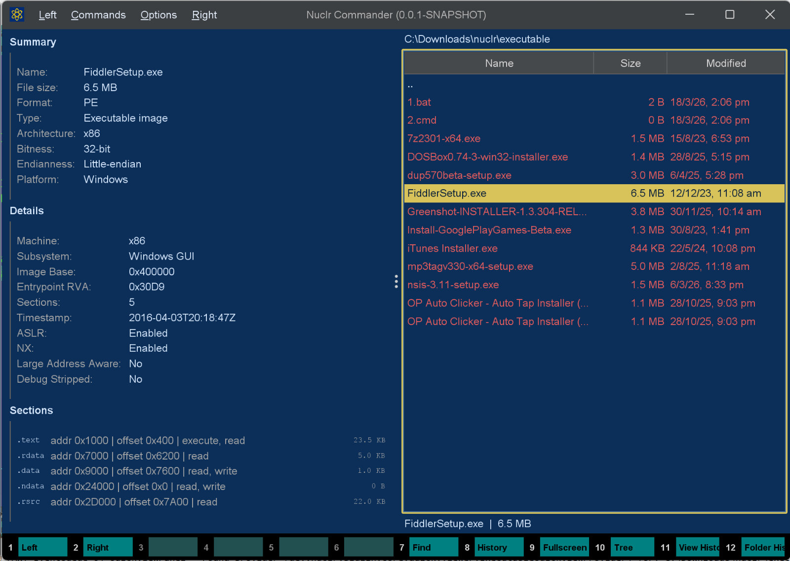

# Executable Quick Viewer

**The least dramatic way to inspect dramatic binaries.**

Read-only executable metadata preview for [Nuclr Commander](https://nuclr.dev), built to make PE, ELF, and Mach-O files reveal their secrets without making you open a hex editor, fire up a disassembler, or pretend this needed to be harder than it is.

<p align="center">
  
</p>

## Why This Exists

Because sometimes you do not want an entire reverse-engineering ceremony just to answer:

- What format is this thing?
- Which architecture is it built for?
- Is it a PE executable, a shared object, a DLL, a bundle?
- Does it expose the usual security flags?
- What sections or slices does it contain?

This plugin handles that fast, directly inside Nuclr Commander, with a level of restraint and competence that should frankly be more common.

## What It Does

Executable Quick Viewer is a focused quick-look plugin for executable metadata. It reads stable header information and presents it in a clean panel designed for glanceable inspection.

It supports:

| Platform | Format | Typical files |
|---|---|---|
| Windows | PE / COFF | `.exe`, `.dll`, `.sys`, `.ocx` |
| Linux / Unix | ELF | executables, `.so`, AppImage-style binaries |
| macOS | Mach-O | executables, `.dylib`, `.bundle`, `.o` |
| macOS | Universal / Fat Mach-O | multi-architecture binaries |

## What You Get

- File summary: name, size, format, type, platform, architecture, bitness, endianness
- Header details: machine / CPU type, subsystem, ABI, image base, entrypoint, interpreter, loader hints
- Common flags: ASLR, NX, PIE, dynamic linking, stripped hints where available
- Structure view: PE sections, ELF sections, Mach-O sections, or fat-binary slices

In short: all the generally available facts you actually want, without the usual binary-analysis theater.

## What It Very Deliberately Does Not Do

This plugin knows its job and performs it with discipline.

It does not do:

- Disassembly
- Decompilation
- Import / export browsing
- Signature verification
- Malware analysis
- Binary execution
- Wild guesswork dressed up as insight

If a piece of information is not generally available from the standard headers, this plugin usually does not pretend otherwise.

## Design Principles

- Fast enough to feel instant
- Safe because it never executes the target file
- Portable because it does not depend on native helper tools
- Useful because it prefers stable metadata over noisy analysis output
- Focused because quick view should stay quick

## Screenshot

The plugin in action, confidently turning opaque binaries into readable metadata:

<p align="center">
  
</p>

## Build

Requirements:

- Java 21+
- Maven 3.9+
- `plugins-sdk` installed locally

Commands:

```bash
mvn test
mvn clean package
```

If your environment is configured for signing:

```bash
mvn clean verify -Djarsigner.storepass=<keystore-password>
```

Build artifacts are written to `target/`.

## Installation

Copy the packaged plugin archive into the Nuclr Commander `plugins/` directory:

```text
quick-view-executables-1.0.0.zip
```

If your setup expects signed plugins, also copy:

```text
quick-view-executables-1.0.0.zip.sig
```

## Repository Layout

```text
src/
|- main/java/dev/nuclr/plugin/core/quick/viewer/
|  |- ExecutableQuickViewProvider.java
|  |- ExecutableViewPanel.java
|  `- exec/
|     |- ExecutableParser.java
|     |- ExecutableFileInfo.java
|     |- ExecutableTableEntry.java
|     `- ExecutableParseException.java
|- main/resources/
|  `- plugin.json
`- test/java/dev/nuclr/plugin/core/quick/viewer/exec/
   `- ExecutableParserTest.java
```

## Testing

The repository includes parser-focused tests covering:

- PE metadata extraction
- ELF metadata extraction
- Fat Mach-O parsing
- Unsupported file handling

## License

Apache License 2.0.
