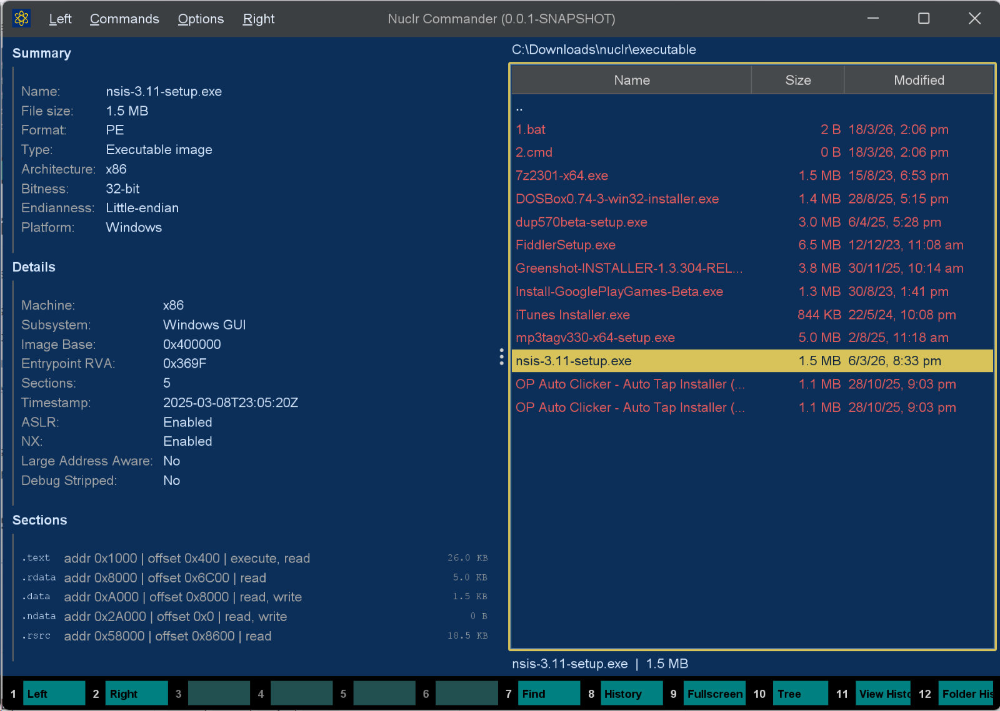

# 🔎 Executable Quick Viewer

**The least dramatic way to inspect dramatic binaries.**

Read-only executable metadata preview for [Nuclr Commander](https://nuclr.dev), built to make PE, ELF, and Mach-O files reveal their secrets without making you open a hex editor, fire up a disassembler, or pretend this needed to be harder than it is. ⚙️

<p align="center">
  
</p>

## 🚀 Why This Exists

Because sometimes you do not want an entire reverse-engineering ceremony just to answer:

- 📦 What format is this thing?
- 🧠 Which architecture is it built for?
- 🧩 Is it a PE executable, a shared object, a DLL, a bundle?
- 🛡️ Does it expose the usual security flags?
- 🗂️ What sections or slices does it contain?

This plugin handles that fast, directly inside Nuclr Commander, with a level of restraint and competence that should frankly be more common.

## ✨ What It Does

Executable Quick Viewer is a focused quick-look plugin for executable metadata. It reads stable header information and presents it in a clean panel designed for glanceable inspection.

## 🧩 Supported Formats

| Platform | Format | Typical files |
|---|---|---|
| 🪟 Windows | PE / COFF | `.exe`, `.dll`, `.sys`, `.ocx` |
| 🐧 Linux / Unix | ELF | executables, `.so`, AppImage-style binaries |
| 🍎 macOS | Mach-O | executables, `.dylib`, `.bundle`, `.o` |
| 🍏 macOS | Universal / Fat Mach-O | multi-architecture binaries |

## 📋 What You Get

- 📄 File summary: name, size, format, type, platform, architecture, bitness, endianness
- 🧠 Header details: machine / CPU type, subsystem, ABI, image base, entrypoint, interpreter, loader hints
- 🛡️ Common flags: ASLR, NX, PIE, dynamic linking, stripped hints where available
- 🧱 Structure view: PE sections, ELF sections, Mach-O sections, or fat-binary slices

In short: all the generally available facts you actually want, without the usual binary-analysis theater.

## 🚫 What It Very Deliberately Does Not Do

- ❌ Disassembly
- ❌ Decompilation
- ❌ Import / export browsing
- ❌ Signature verification
- ❌ Malware analysis
- ❌ Binary execution
- ❌ Wild guesswork dressed up as insight

## 🖼️ Screenshot

<p align="center">
  
</p>

## 📥 Installation

Copy the signed plugin archive and detached signature into the Nuclr Commander `plugins/` directory:

```text
quick-view-executables-<version>.zip
quick-view-executables-<version>.zip.sig
```

Nuclr Commander verifies the RSA-SHA256 signature against `nuclr-cert.pem` on load. The plugin becomes available immediately without a restart.

## 🗂️ Source Layout

```text
src/main/java/dev/nuclr/plugin/core/quick/viewer/
├── ExecutableQuickViewProvider.java   plugin entry point
├── ExecutableViewPanel.java           Swing UI renderer
└── exec/
    ├── ExecutableParser.java          PE / ELF / Mach-O header parsing
    ├── ExecutableFileInfo.java        parsed metadata model
    ├── ExecutableTableEntry.java      display row model
    └── ExecutableParseException.java  parse error
```

## 🧪 Tests

The repository includes parser-focused unit tests covering:

- 🪟 PE metadata extraction
- 🐧 ELF metadata extraction
- 🍎 Fat Mach-O parsing
- 🚨 Unsupported file handling

## 📚 Dependencies

All dependencies are provided by Nuclr Commander at runtime — nothing extra is bundled in the plugin ZIP.

| Library | Version | Purpose |
|---|---|---|
| `dev.nuclr:platform-sdk` | `3.0.1` | Nuclr platform interfaces |

## 📄 License

Apache License 2.0.
